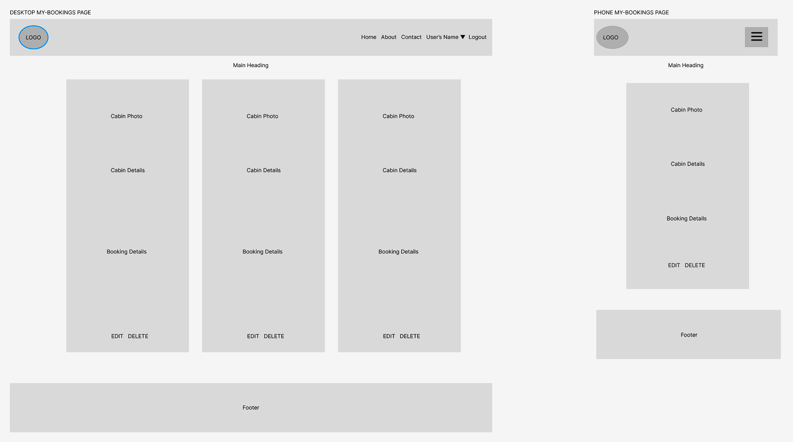

# Woodland Whispers Retreat

Discover a serene lakeside getaway at Woodland Whispers Retreat. Our Django-based website offers a seamless platform for exploring and booking cozy cabin rentals in a picturesque setting. Immerse yourself in nature, enjoy excellent fishing, embark on kayaking adventures, hike scenic trails, swim in refreshing lake waters, and even explore nearby caves. Experience the perfect blend of tranquility and outdoor recreation at Woodland Whispers Retreat. Book your cabin today and create unforgettable memories in this lakeside haven.

[View Woodland Whispers Retreat live website here](https://woodland-whispers-retreat.herokuapp.com/)
- - -

## Table of Contents

---

## User Experience (UX)

Immerse yourself in a seamless and captivating user experience at Woodland Whispers Retreat. Our website offers intuitive navigation, stunning visuals, and a hassle-free booking process. Personalized recommendations, comprehensive information, and responsive support ensure that your needs are met every step of the way. Enjoy a mobile-friendly experience, easily planning your lakeside getaway from any device. Discover tranquility and outdoor adventures at Woodland Whispers Retreat, where your journey from exploration to booking is effortlessly delightful.

### Project Goals

The goal of the Woodland Whispers Retreat project is to create an immersive and user-friendly online platform that allows visitors to explore, book, and enjoy a serene lakeside getaway. The project aims to provide a seamless user experience, showcasing the beauty of the retreat through captivating visuals and comprehensive information and a booking process for their dream retreat.

### Agile Methodology

Agile Methodology was used to help prioritize and organize tasks, writting the user stories and using Project Boards on Github. Template was created to help write User Stories and define Epics

* Epics were written containing possible user stories and based on that the website was made.
* User stories were created by looking at epics and through iterations the project was advancing.
* Project Board is set to public.
* Project Board was used to track progression of the task through the Todo, In progress and Done columns
* Labels were added to sort the issues based on the importance.

 User Stories Template

 User Stories, Issues

 Project Board

### User Stories

#### Epics
* Initial Deployment
* Home Page
* User Registration
* Website Admin and Bookings
* Maintain consistent design with responsiveness in mind

#### User Stories
1. Initial Deployment
* Create new Heroku application
* Link Github repository to the Heroku app
2. Home Page
* Create a navigation bar
* Create a footer
3. User Registration
* Sign Up page
* User registration, log in, log out
* Display users name
4. Website Admin and Bookings
* Alert messages
* Crud functionality
* Cabin pagination
* Admin panel
* Double bookings
* Book Amenities
* Total Price
4. Maintain consistent design with responsiveness in mind
* Maintain consistent design
* Test responsiveness

Detailed look can be found in the [project board](https://github.com/users/Thomas-Tomo/projects/2)

### Target Audience

* Individuals seeking a serene and tranquil lakeside retreat experience.
* Travelers looking for a seamless and hassle-free booking process for their getaway.
* Outdoor enthusiasts interested in exploring nature and enjoying outdoor adventures.
* People who value a captivating and visually appealing online experience.
* Mobile users who want the convenience of planning their retreat from any device.
* Couples looking for a romantic and secluded getaway surrounded by nature's beauty.
* Families in search of a serene and family-friendly retreat to create lasting memories.
* Nature photographers or artists searching for picturesque landscapes and natural inspiration.

### First time user

* Simple and intuitive website navigation for easy exploration and discovery.
* Engaging visuals showcasing the beauty of the retreat and its surroundings.
* Informative content providing an overview of amenities, activities.
* User-friendly forms with clear validation messages to ensure accurate input.
* Easy Registration process.

### Registered User

* Seamless login process with a secure and personalized user account.
* Browsing available cabins
* Booking
* Access to a personalized dashboard displaying booking history and upcoming reservations.
* Ability to easily modify or cancel existing bookings for flexibility and convenience.

### Admin user

* Secure and separate login portal for admin users with appropriate access control.
* Access to an admin dashboard for managing cabins, amenities, and bookings.
* Ability to add, edit, or delete cabin listings, including details and availability.
* Management of amenity options, such as adding, updating, or removing amenities.
* Ability to delete user accounts, providing the necessary control for managing user data and accounts.
* Management of bookings, including the ability to view, modify, or delete bookings as needed.

## Design

The Woodland Whispers Retreat website boasts an inviting and visually pleasing design. Earthy tones and a warm color palette evoke a sense of tranquility. The navigation bar features a circular logo and easy-to-read text. Captivating photos are displayed in a bordered carousel with elegant captions. The about section utilizes a dark background and horizontal lines for clarity. Social media links are presented in the contact section, and the footer complements the overall design.

### Color Scheme

### Cabin Images

All cabin images were created using Artificial Inteligence, AI image generator [Craiyon](https://www.craiyon.com/).

### Logo

Logo was also created using AI image generator [Craiyon](https://www.craiyon.com/).

### Typography

The 'Lora' font is specified as the primary font, and the 'Domine' font is specified as a fallback font.

### Wireframes

 Home Page

 Home Page when logged in

 Contact Page

 Cabin Booking Page

 Make a Booking Page

 My Booking Page

 Edit Booking Page

 Delete Booking Page

 User Login Page

 User Logout Page

 User Sign Up Page

### Data Models

1. AllAuth User Model
    * Django Allauth, the User model is the default user model provided by the Django authentication system
    * The User entity has a one-to-many relationship with the Booking entity. This means that a User can have multiple Bookings, but each Booking is associated with only one User.
---
2. Amenity Model
    * Data model created so admin can add amenities to the cabin booking, and regulate the name and price of the amenities
    * Only Admin can change the data in the backend.
    * User can book those amenities through the Booking Model
    * An Amenity can be associated with multiple Cabins, and a Cabin can have multiple Amenities. This is represented by the many-to-many relationship between Amenity and Cabin.
    * There are two amenites set up, which are cave exploration and kayak rental
---
3. Cabin Model
    * A Cabin can have multiple Bookings, but each Booking is associated with only one Cabin. This is represented by the foreign key relationship between Cabin and Booking.
    * Admin can add cabins through djangos admin panel.
    * Only Admin can change the data in the backend.
    * User can see the cabin information and image based on the chosen cabin.
    * Information provided is price, image, description, number of bedrooms, maximum guests, amenities
---
4. Booking Model
    * A User can have multiple Bookings, but each Booking is associated with only one User. This is represented by the foreign key relationship between User and Booking.
    * Booking model has a feature that prevents overlapping bookings, so users dont book on the same dates
    * Total price is also calculated in the backend that is then displayed to user to show the total price of the booking, that includes if a user also adds amenities to the booking.
    * Full CRUD functionality is available to the user.
    * User in order to book has to fill check-in, check-out dates, number of guests and optional amenities
    ---

### User Journey 

### Database Scheme

Entity Relationship Diagram (ERD)

* The Amenity entity represents amenities that can be associated with cabins, with fields id as the primary key, name for the amenity's name, and price for the amenity's price.
* The Cabin entity represents individual cabin listings, with fields id as the primary key, name for the cabin's name, description for the cabin's description, price for the cabin's price, image for the cabin's image, max_guests for the maximum number of guests allowed, and bedrooms for the number of bedrooms in the cabin.
* The Booking entity represents a booking made by a user for a specific cabin, with fields id as the primary key, cabin_id as a foreign key referencing the Cabin entity, user_id as a foreign key referencing the User entity, check_in_date for the booking's check-in date, check_out_date for the booking's check-out date, num_guests for the number of guests in the booking, cave_exploration_tickets for the optional quantity of cave exploration tickets, kayak_rentals for the optional quantity of kayak rentals, and total_price for the total price of the booking.

This data scheme allows for the management of users, amenities, cabins, and bookings. Users can make bookings for specific cabins, and each booking can have associated details such as the check-in and check-out dates, number of guests, and optional extras.

## Security Features

### User Authentication

* Django Allauth is a popular authentication and authorization library for Django, which provides a set of features for managing user authentication, registration, and account management.

### Login Decorator

* booking_create, booking_success, booking_overview, edit_booking, and delete_booking: These views involve operations related to user bookings and require authentication with the login_required decorator.
* This ensures that only authenticated users can access these views.

### CSRF Protection

* Django provides built-in protection against Cross-Site Request Forgery (CSRF) attacks. CSRF tokens are generated for each user session, and they are required to submit forms or perform state-changing actions. When a user logs out, the session and associated CSRF token are invalidated, making it difficult for an attacker to forge a valid request using a copied URL.

### Form Validation

* The booking_create view validates form input using the BookingForm class. It checks for various validation errors, such as the number of guests, check-in and check-out dates, overlapping bookings, and additional validations for cave exploration tickets and kayak rentals.

### Overlapping Booking

* In the booking_create view, the code checks for overlapping bookings by querying the database for existing bookings that match certain conditions. It compares the selected check-in and check-out dates with the dates of existing bookings for the same cabin. If any overlapping bookings are found, an error message is added to the form, and a warning message is displayed to the user.

### Custom error pages

* 404 Error Page, provides user with a button the redirect to home page.
* 500 Error Page, provides user with a button the redirect to home page.