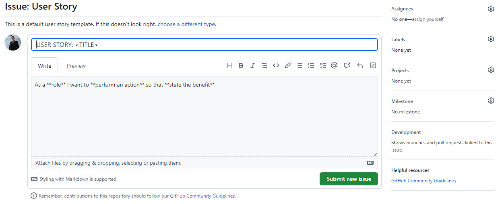

# Woodland Whispers Retreat

Discover a serene lakeside getaway at Woodland Whispers Retreat. Our Django-based website offers a seamless platform for exploring and booking cozy cabin rentals in a picturesque setting. Immerse yourself in nature, enjoy excellent fishing, embark on kayaking adventures, hike scenic trails, swim in refreshing lake waters, and even explore nearby caves. Experience the perfect blend of tranquility and outdoor recreation at Woodland Whispers Retreat. Book your cabin today and create unforgettable memories in this lakeside haven.

[View Woodland Whispers Retreat live website here](https://woodland-whispers-retreat.herokuapp.com/)
- - -

## Table of Contents

---

## User Experience (UX)

Immerse yourself in a seamless and captivating user experience at Woodland Whispers Retreat. Our website offers intuitive navigation, stunning visuals, and a hassle-free booking process. Personalized recommendations, comprehensive information, and responsive support ensure that your needs are met every step of the way. Enjoy a mobile-friendly experience, easily planning your lakeside getaway from any device. Discover tranquility and outdoor adventures at Woodland Whispers Retreat, where your journey from exploration to booking is effortlessly delightful.

### Project Goals

The goal of the Woodland Whispers Retreat project is to create an immersive and user-friendly online platform that allows visitors to explore, book, and enjoy a serene lakeside getaway. The project aims to provide a seamless user experience, showcasing the beauty of the retreat through captivating visuals and comprehensive information and a booking process for their dream retreat.

### Agile Methodology

Agile Methodology was used to help prioritize and organize tasks, writting the user stories and using Project Boards on Github. Template was created to help write User Stories and define Epics

* Epics were written containing possible user stories and based on that the website was made.
* User stories were created by looking at epics and through iterations the project was advancing.
* Project Board is set to public.
* Project Board was used to track progression of the task through the Todo, In progress and Done columns
* Labels were added to sort the issues based on the importance.

 User Stories Template

 User Stories, Issues

 Project Board

### User Stories

#### Epics
* Initial Deployment
* Home Page
* User Registration
* Website Admin and Bookings
* Maintain consistent design with responsiveness in mind

#### User Stories
1. Initial Deployment
* Create new Heroku application
* Link Github repository to the Heroku app
2. Home Page
* Create a navigation bar
* Create a footer
3. User Registration
* Sign Up page
* User registration, log in, log out
* Display users name
4. Website Admin and Bookings
* Alert messages
* Crud functionality
* Cabin pagination
* Admin panel
* Double bookings
* Book Amenities
* Total Price
4. Maintain consistent design with responsiveness in mind
* Maintain consistent design
* Test responsiveness

Detailed look can be found in the [project board](https://github.com/users/Thomas-Tomo/projects/2)

### Target Audience

* Individuals seeking a serene and tranquil lakeside retreat experience.
* Travelers looking for a seamless and hassle-free booking process for their getaway.
* Outdoor enthusiasts interested in exploring nature and enjoying outdoor adventures.
* People who value a captivating and visually appealing online experience.
* Mobile users who want the convenience of planning their retreat from any device.
* Couples looking for a romantic and secluded getaway surrounded by nature's beauty.
* Families in search of a serene and family-friendly retreat to create lasting memories.
* Nature photographers or artists searching for picturesque landscapes and natural inspiration.

### First time user

* Simple and intuitive website navigation for easy exploration and discovery.
* Engaging visuals showcasing the beauty of the retreat and its surroundings.
* Informative content providing an overview of amenities, activities.
* User-friendly forms with clear validation messages to ensure accurate input.
* Easy Registration process.

### Registered User

* Seamless login process with a secure and personalized user account.
* Browsing available cabins
* Booking
* Access to a personalized dashboard displaying booking history and upcoming reservations.
* Ability to easily modify or cancel existing bookings for flexibility and convenience.

### Admin user

* Secure and separate login portal for admin users with appropriate access control.
* Access to an admin dashboard for managing cabins, amenities, and bookings.
* Ability to add, edit, or delete cabin listings, including details and availability.
* Management of amenity options, such as adding, updating, or removing amenities.
* Ability to delete user accounts, providing the necessary control for managing user data and accounts.
* Management of bookings, including the ability to view, modify, or delete bookings as needed.