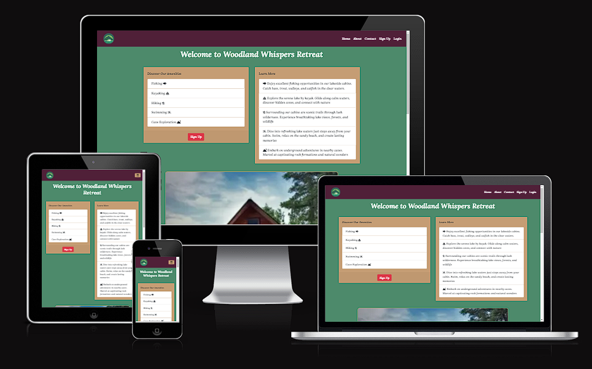
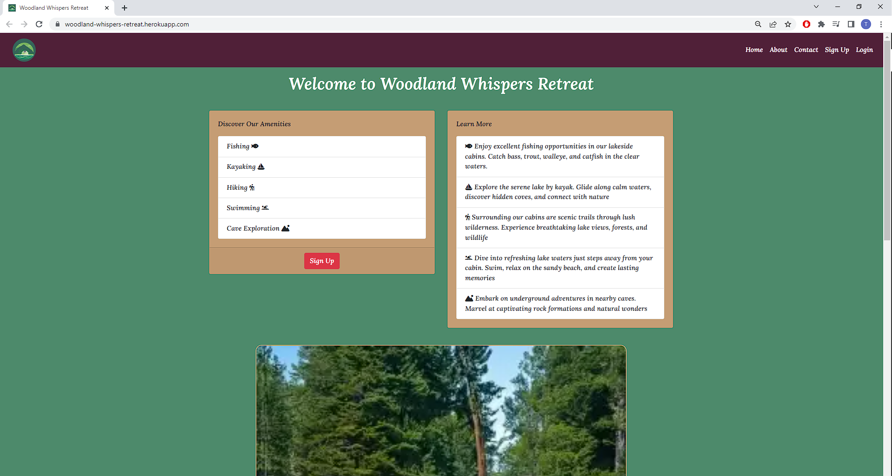
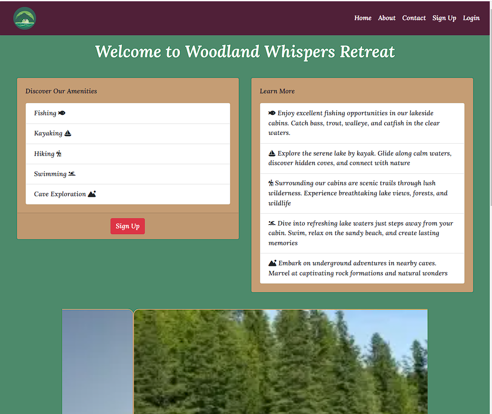
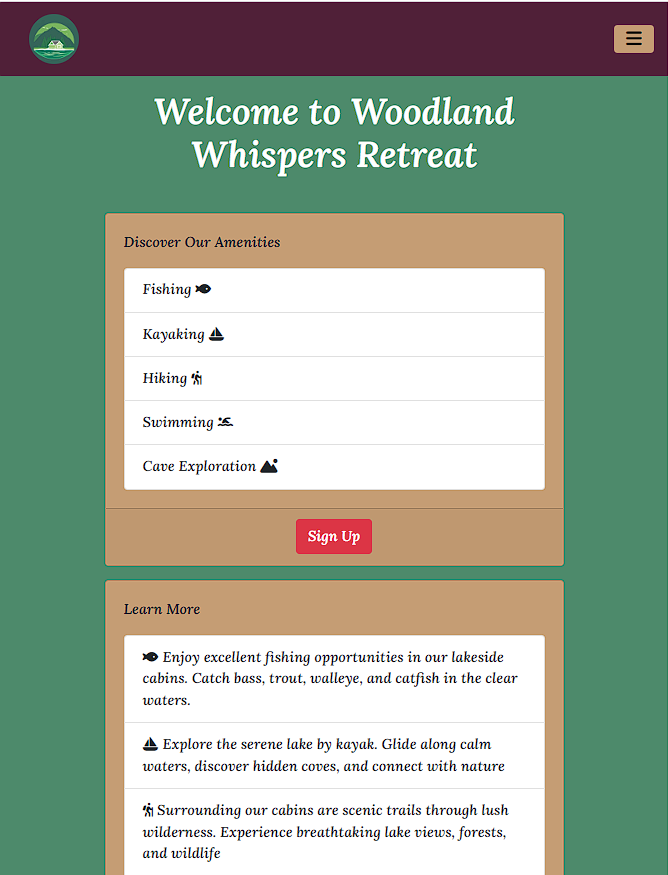
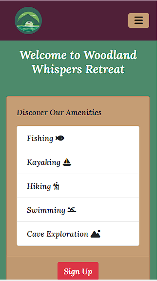
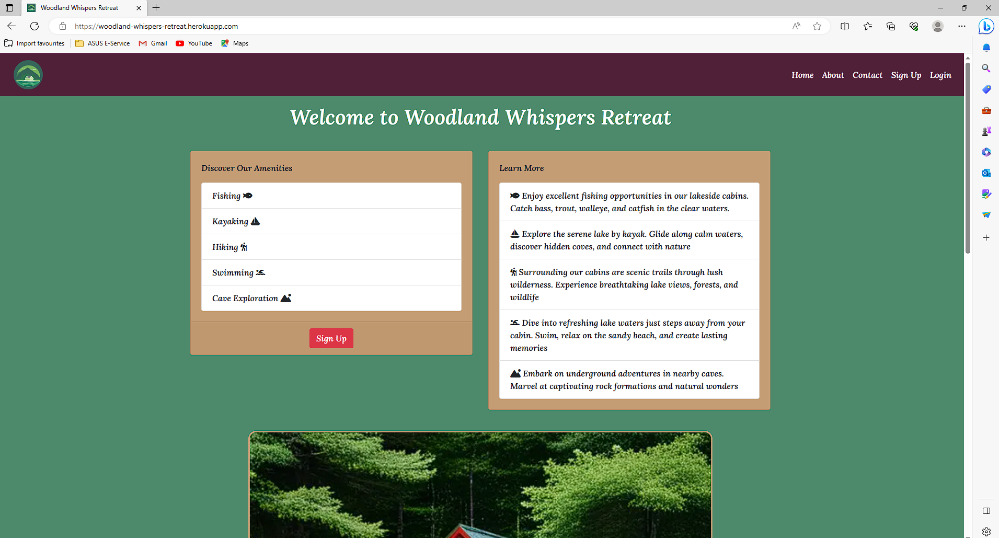
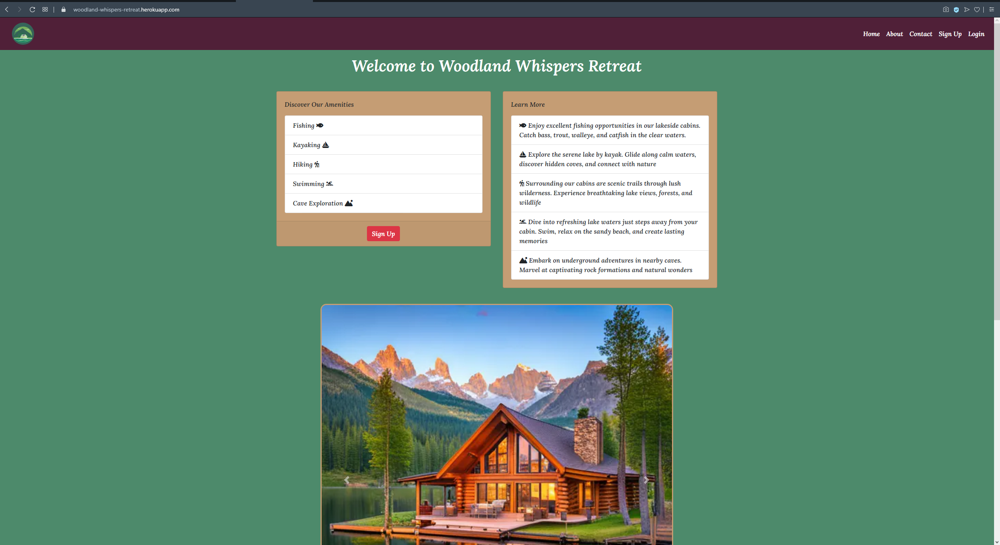
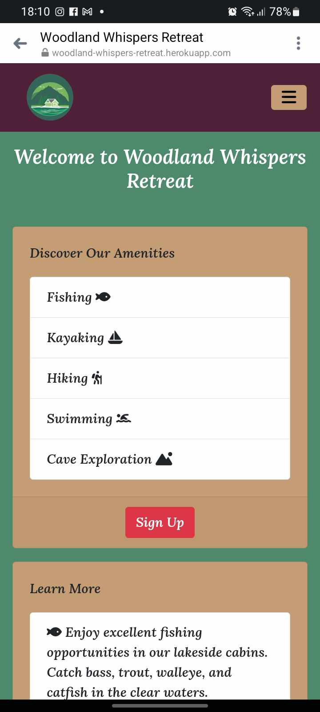

# Woodland Whispers Retreat | Testing

Return to [README](README.md)
- - -
Comprehensive testing has been performed to ensure the website's seamless and optimal functionality.

## Table of Contents

---

## Responsiveness Testing

The deployed website underwent rigorous testing on multiple devices and screen sizes to ensure its responsiveness and adaptability. Developer Tools were utilized to simulate various screen sizes, enabling thorough examination of how the website behaves across different devices. Bootstrap classes and media queries were implemented to achieve the desired design, ensuring that the website maintains its visual and functional integrity on all platforms, enhancing the user experience.

 Desktop PC

 Laptop

 Tablet

 Mobile

## Browser Compatibility Testing

The project was tested on multiple web browsers to check for compatibility issues and ensure it functions as expected across all of them. This testing process guarantees a smooth and consistent user experience, regardless of the browser used.

 Chrome

 Microsoft Edge

 Opera

 Samsung Internet (Mobile)

## Device Testing

Device testing was conducted on a variety of phone models, including Samsung Galaxy A52, Oppo, iPhone 12, Huawei. The assistance of family members and friends was sought to perform the testing. This comprehensive approach ensured that the website was thoroughly evaluated on different devices and platforms, contributing to a more robust and user-friendly final product.